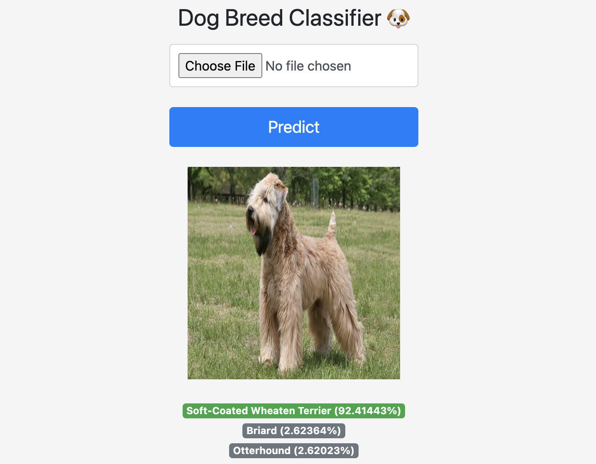

<<<<<<< Updated upstream
<!--
*** Thanks for checking out the Best-README-Template. If you have a suggestion
*** that would make this better, please fork the repo and create a pull request
*** or simply open an issue with the tag "enhancement".
*** Thanks again! Now go create something AMAZING! :D
***
***
***
*** To avoid retyping too much info. Do a search and replace for the following:
*** danielchang2002, DogBreedClassification, twitter_handle, email, project_title, project_description
-->


<!-- PROJECT SHIELDS -->
<!--
*** I'm using markdown "reference style" links for readability.
*** Reference links are enclosed in brackets [ ] instead of parentheses ( ).
*** See the bottom of this document for the declaration of the reference variables
*** for contributors-url, forks-url, etc. This is an optional, concise syntax you may use.
*** https://www.markdownguide.org/basic-syntax/#reference-style-links
-->
[![Contributors][contributors-shield]][contributors-url]
[![Forks][forks-shield]][forks-url]
[![Stargazers][stars-shield]][stars-url]
[![Issues][issues-shield]][issues-url]
[![MIT License][license-shield]][license-url]
[![LinkedIn][linkedin-shield]][linkedin-url]


<!-- PROJECT LOGO -->
<br />
<p align="center">

  <h3 align="center">Dog Breed Classifier</h3>

  <p align="center">
    Dog breed classifier built with the ResNet architcture and ImageNet transfer learning: trained on the Stanford dog breed dataset
    <br />
    <a href="https://github.com/danielchang2002/DogBreedClassification"><strong>Explore the docs »</strong></a>
    <br />
    <br />
    <a href="https://github.com/danielchang2002/DogBreedClassification">View Demo</a>
    ·
    <a href="https://github.com/danielchang2002/DogBreedClassification/issues">Report Bug</a>
    ·
    <a href="https://github.com/danielchang2002/DogBreedClassification/issues">Request Feature</a>
  </p>
</p>


=======
# Dog Breed Classifier
> Neural network that classifies the top 120 dog breeds 
>>>>>>> Stashed changes

<!-- TABLE OF CONTENTS -->
<details open="open">
  <summary><h2 style="display: inline-block">Table of Contents</h2></summary>
  <ol>
    <li>
      <a href="#about-the-project">About The Project</a>
      <ul>
        <li><a href="#built-with">Built With</a></li>
      </ul>
    </li>
    <li>
      <a href="#getting-started">Getting Started</a>
      <ul>
        <li><a href="#installation">Installation</a></li>
      </ul>
    </li>
    <li><a href="#license">License</a></li>
    <li><a href="#contact">Contact</a></li>
    <li><a href="#contributing">Contributing</a></li>
    <li><a href="#acknowledgements">Acknowledgements</a></li>
  </ol>
</details>

## About the Project

Dog breed classifier built with the ResNet architecture and ImageNet transfer learning: trained on the Stanford dog breed dataset with the fastai library for pytorch

<<<<<<< Updated upstream
<!-- ABOUT THE PROJECT -->
## About The Project


### Built With

* [https://docs.fast.ai/](fastai)
* [https://flask.palletsprojects.com/en/1.1.x/](flask)
* [heroku.com](heroku)


<!-- GETTING STARTED -->
## Getting Started
=======


### Built With

* [https://docs.fast.ai/](fastai/pytorch)
* [https://flask.palletsprojects.com/en/1.1.x/](flask)
* [heroku.com](heroku)
>>>>>>> Stashed changes

## Installation


<<<<<<< Updated upstream
* pip
  ```sh
=======
```sh
    git clone https://github.com/danielchang2002/DogBreedClassification.git
>>>>>>> Stashed changes
    pip install -r requirements.txt
```

## Meta

<<<<<<< Updated upstream
1. Clone the repo
   ```sh
   git clone https://github.com/danielchang2002/DogBreedClassifier.git
   ```
2. Run Flask app
   ```sh
    flask run
   ```
=======
Daniel Chang – [@YourTwitter](https://twitter.com/danielchang2002) – danielchang2002@gmail.com
>>>>>>> Stashed changes

https://github.com/danielchang2002/

## Contributing

1. Fork it (<https://github.com/yourname/yourproject/fork>)
2. Create your feature branch (`git checkout -b feature/fooBar`)
3. Commit your changes (`git commit -am 'Add some fooBar'`)
4. Push to the branch (`git push origin feature/fooBar`)
5. Create a new Pull Request


    <a href="https://github.com/github_username/repo_name">View Demo</a>
    ·
    <a href="https://github.com/github_username/repo_name/issues">Report Bug</a>
    ·
    <a href="https://github.com/github_username/repo_name/issues">Request Feature</a>
  </p>
</p>


<<<<<<< Updated upstream
See the [open issues](https://github.com/danielchang2002/DogBreedClassification/issues) for a list of proposed features (and known issues).
=======
>>>>>>> Stashed changes


<<<<<<< Updated upstream
=======
## Usage


Deployed live at: 
https://dog-neural-net.herokuapp.com/


>>>>>>> Stashed changes
<!-- CONTACT -->
## Contact

Daniel Chang - [@twitter_handle](https://twitter.com/danielchang2002) - danielchang2002@gmail.com

Project Link: [https://github.com/danielchang2002/DogBreedClassification](https://github.com/danielchang2002/DogBreedClassification)


<!-- ACKNOWLEDGEMENTS -->
## Acknowledgements

* [https://github.com/fastai/fastbook/blob/master/01_intro.ipynb](fastai lesson)
* [https://www.youtube.com/watch?v=BUh76-xD5qU&t=2259s&ab_channel=AbhishekThakur](deployment instructions)
* [https://flask.palletsprojects.com/en/1.1.x/](flask documentation)
* [https://www.kaggle.com/jessicali9530/stanford-dogs-dataset](stanford dataset on kaggle)


<!-- MARKDOWN LINKS & IMAGES -->
<!-- https://www.markdownguide.org/basic-syntax/#reference-style-links -->
[contributors-shield]: https://img.shields.io/github/contributors/danielchang2002/repo.svg?style=for-the-badge
[contributors-url]: https://github.com/danielchang2002/DogBreedClassification/graphs/contributors
[forks-shield]: https://img.shields.io/github/forks/danielchang2002/repo.svg?style=for-the-badge
[forks-url]: https://github.com/danielchang2002/DogBreedClassification/network/members
[stars-shield]: https://img.shields.io/github/stars/danielchang2002/repo.svg?style=for-the-badge
[stars-url]: https://github.com/danielchang2002/DogBreedClassification/stargazers
[issues-shield]: https://img.shields.io/github/issues/danielchang2002/repo.svg?style=for-the-badge
[issues-url]: https://github.com/danielchang2002/repo/issues
[license-shield]: https://img.shields.io/github/license/danielchang2002/repo.svg?style=for-the-badge
[license-url]: https://github.com/danielchang2002/repo/blob/master/LICENSE.txt
[linkedin-shield]: https://img.shields.io/badge/-LinkedIn-black.svg?style=for-the-badge&logo=linkedin&colorB=555
[linkedin-url]: https://www.linkedin.com/in/daniel-chang-b93473204/


